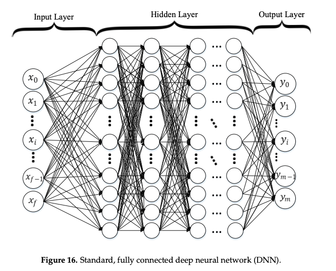
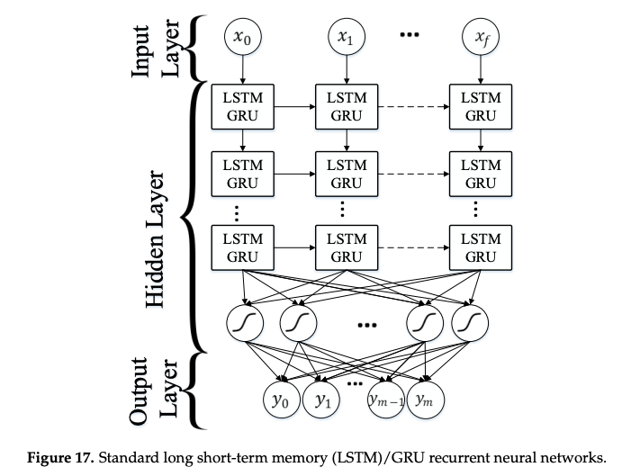

# Background

最近在做分类平台，发现一个问题，那就是简单分类任务直接使用 `Bert-Sigmoid/Softmax` 这套分类体系，效果并不是很好。我用于测试的任务只有几个分类，每个类别 1000 条训练数据，在这个级别的任务下，猜测传统方法已经能满足要求。

同时，分类这个活我接过来就是用 `bert` 的，对于传统方法缺乏认识，也没有上手操作过。因此觉得找点综述看是有必要的，从今天这篇开始。

# Paper

> Text Classification Algorithms: A Survey https://arxiv.org/pdf/1904.08067.pdf

## Introduction

1. Feature Extraction: TF-IDF, TF, Word2Vec, GloVe... 
2. Dimensionality Reduction: PCA, LDA, NMF...
3. Classification Techniques: traditional, ensemble-based, deep-learning...
4. Evaluation: F-beta, ROC, AUC...

## 预处理部分

1. 分词
2. 去除 stop words，如 "a", "about", "above", etc
3. 大小写。全部转为小写这种最简单的处理可能会带来一些问题，比如 "US" -> "us"
4. Slang 和缩写
5. 标点符号、特殊字符
6. Stemming，去掉 -ed, -ing 等后缀。中文文本中较少应用。

## 词句表示

### n-gram

 使用大小为n的窗口内的词作为句子的划分。得到分词结果后从而进一步得到句子表示。

```
>>> n=2
>>> After sleeping for four hours, he decided to sleep for another four. 

<<< { “After sleeping”, “sleeping for”, “for four”, “four hours”, “four he” “he decided”, “decided to”, “to sleep”, “sleep for”, “for another”, “another four” } 
```

此外还有 syntactic n-grams，使用句法依存树中的词语关系取代句子本身的连续词语关系。

## 词表权重

### BOW

挖坑

### TF-IDF

TF 即词频，IDF 即逆文本频率。词语在本文章出现次数越多，同时不是每篇文章都有，说明这个词语的重要性越高。
$$
IDF(word,para) = log(\frac{N}{df(word)}) \\
TFIDF(word,para) = TF(word,para)*IDF(word,para)
$$
N表示文章总量，df(word) 指含有 word 的文章数量。

## Embedding

### Word2Vec

挖坑

### GloVe

挖坑

### FastText

挖坑

### Contextualized Word Representations

挖坑

## 降维

挖坑

## 分类算法

### Rocchio

使用 TF-IDF 为每个词语计算权重，从而获得句子的向量表示。

用所有属于该类的文本向量平均值作为该类别的 prototype vector。

分类方法是计算文本向量和所有 prototype vector 的相似度。

### 聚类算法

挖坑

### LR/贝叶斯/KNN/SVM

挖坑

### 决策树/随机森林

挖坑

### CRF

挖坑

### DNN

深层神经网络，纯粹使用全连接层和激活函数来学习句子的表示。



### RNN

借助循环神经网络的特点，分 timestep 来输入数据，更好的利用了文本的上下文信息。目前常用的 Unit 主要有 LSTM 和 GRU 两种。



